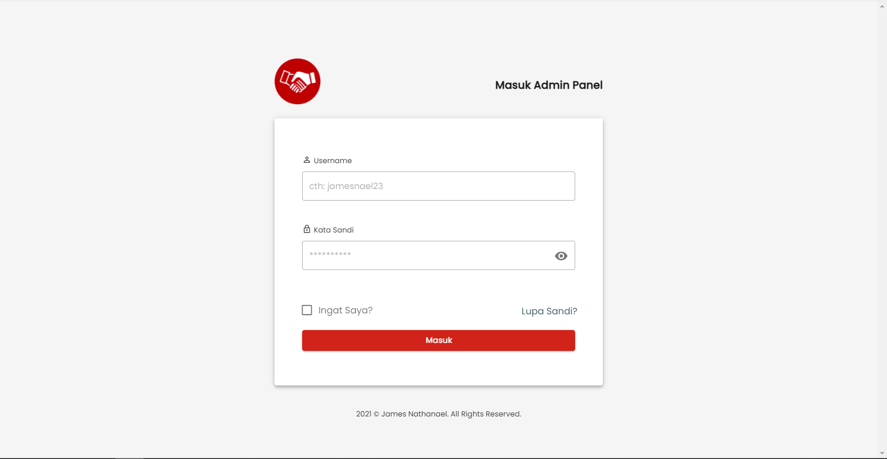

# laravel-vuetify-admin

Vue 2.6 + Laravel 8 + Admin Template CRUD example Using Vuetify




### Installation

1. Clone the repository

2. Change to directory

````
cd laravel-vuetify-admin
````   

3. Install dependencies

````
composer install
````

4. Copy .env file

```
cp .env.example .env
```

5. Modify `DB_*` value in `.env` with your database config.

6. Generate application key:

````
php artisan key:generate
````

7. Migrate
````
php artisan migrate
````

8. Install Node modules
````
npm install
````

9. Build

````
npm run dev
````
or
````
npm run watch
````

### Dummy Data

1. Generate the db seeder

````
php artisan db:seed
````
    
2. Generate the modules seeder
````
php artisan module:seed
````
